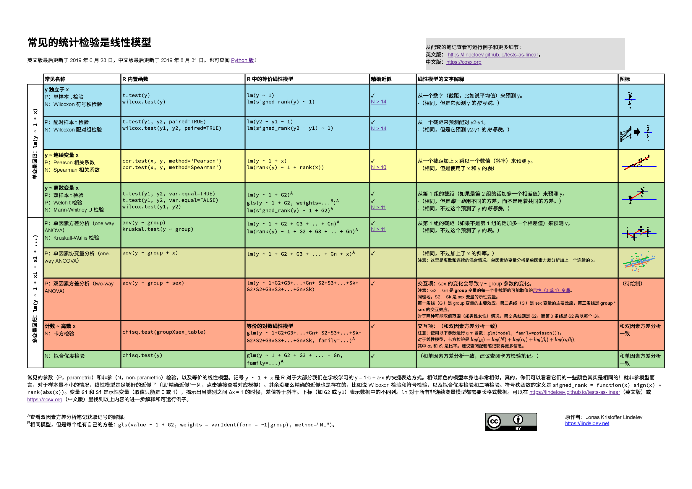

<link rel="stylesheet" type="text/css" href="include/style.css">

<!-- From https://stackoverflow.com/a/37839683/1297830 -->
<link rel="stylesheet" type="text/css" href="include/hideOutput.css">
<script src="include/hideOutput.js"></script>

作者：Jonas Kristoffer Lindeløv ([博客](https://lindeloev.net), [个人主页](http://personprofil.aau.dk/117060)).<br />
最后更新日期：`r format(Sys.time(), '%d %B, %Y')` (见 [更新日志](https://github.com/lindeloev/tests-as-linear/commits/master))。<br />
可查阅[Python 版本](https://eigenfoo.xyz/tests-as-linear/) 和 [Twitter 概况](https://twitter.com/jonaslindeloev/status/1110907133833502721).


<!-- Social sharing. From simplesharebuttons.com -->
<style type="text/css">
  #share-buttons img {
    width: 40px;
    padding-right: 15px;
    border: 0;
    box-shadow: 0;
    display: inline;
    vertical-align: top;
  }
</style>

<div id="share-buttons">
<!-- Twitter --><script async src="https://platform.twitter.com/widgets.js" charset="utf-8"></script><a href="https://twitter.com/intent/tweet?text=Common%20statistical%20tests%20are%20linear%20models%20(or:%20how%20to%20teach%20stats)%20https%3A%2F%2Flindeloev.github.io%2Ftests-as-linear%20via%20%40jonaslindeloev" class="twitter-hashtag-button" data-size="large" data-related="jonaslindeloev" data-show-count="false">Share on Twitter</a> &nbsp;&nbsp;&nbsp;<!-- Facebook --><a href="http://www.facebook.com/sharer.php?u=https://lindeloev.github.io/tests-as-linear/" target="_blank"></a><!-- LinkedIn --><a href="http://www.linkedin.com/shareArticle?mini=true&amp;url=https://lindeloev.github.io/tests-as-linear/" target="_blank"></a><!-- Digg --><a href="http://www.digg.com/submit?url=https://lindeloev.github.io/tests-as-linear/" target="_blank"></a><!-- Reddit --><a href="http://reddit.com/submit?url=https://lindeloev.github.io/tests-as-linear/&amp;title=Common statistical tests are linear models (or: how to teach stats)" target="_blank"></a><!-- Email --><a href="mailto:?Subject=Common statistical tests are linear models (or: how to teach stats)&amp;Body=https://lindeloev.github.io/tests-as-linear/"></a>
</div>


<br />

```{r echo=FALSE}
# Options for building this document
knitr::opts_chunk$set(
  fig.height = 4,
  fig.width = 6,
  fig.align = 'center',
  message = FALSE,
  warning = FALSE
)

#devtools::install_github("jumpingrivers/headR")
headR::add_twitter_card(
  card_type = "summary_large_image",
  title = "Common statistical tests are linear models (or: how to teach stats)",
  user = "@jonaslindeloev",
  image = "https://lindeloev.github.io/tests-as-linear/linear_tests_cheat_sheet.png",
  file = "include/twitter_card.html"
)

# To show tables.
print_df = function(D,
                    decimals = 4,
                    navigate = FALSE) {
  DT::datatable(
    mutate_if(D, is.numeric, round, decimals),
    rownames = FALSE,
    options = list(
      searching = FALSE,
      lengthChange = FALSE,
      ordering = FALSE,
      autoWidth = TRUE,
      bPaginate = navigate,
      bInfo = navigate,
      paging = navigate
    )
  )
}
```


此文档整理如下表。它展示了在常见的参数和“非参”检验之下的线性模型。在同一个框架下展示所有检验，表达出了它们之间的许多相似之处。获得[图片版本](linear_tests_cheat_sheet.png)或 [PDF 版本](linear_tests_cheat_sheet.pdf)。

***

[](linear_tests_cheat_sheet.pdf)

***


# 常见检验的简洁本质

大部分常见统计模型（t 检验、相关性、方差分析（ANOVA）、卡方，等等）都是线性模型的特殊形式，或者是很接近的近似行是。这漂亮的简洁性，意味着我们需要学习更少东西。特别地，这都来源于大部分学生从高中就学习的模型：$y = a \cdot x + b$。不幸地，统计入门课程通常把各种检验教导魏独立的工具，更不要提它们对学生和教师生活所增加的复杂性了。

当学生想分别学习每一个检验背后的参数假设的时候，相比于从线性模型进行推导，教材里多余的复杂性变得更为复杂。

因此，我认为，先教导线性模型和扩展，*然后* 对于一些特殊形式进行“改名”，这种方式是一种优秀的教导策略，并且有助于更深刻地 *理解* 假设检验。因为线性模型在频率学派、贝叶斯学派、基于置换的推断之间，都是相同的。我认为从模型开始，比从 p 值、第 1 类错误、贝叶斯因子、或其它东西开始，更为友好。

当考虑到在入门课程教授 *“非参”* 检验的时候，我认为我们可以修改“[向儿童欺骗](https://en.wikipedia.org/wiki/Lie-to-children)”，并且教导学生“非参”检验其实就是和秩相关的参数检验。对学生来说，思考“秩！”，更优于相信你可以魔术般地扔掉各种假设。实际上，在 [JASP](https://jasp-stats.org/) 里，“非参”检验的贝叶斯等价模型，确实[就是使用（隐）秩](https://arxiv.org/abs/1712.06941)来实现的。这里讨论的频率学派的“非参”检验，对于 N > 15 的情况来说非常精确。

<center>

</center>

<br />

使用导航栏来跳转到你最喜欢的章节。在[来源](#links)和[教材](#course)两章，有很多类似（尽管更为散乱）的材料。我希望你们可以一起来提供优化建议，或者直接在[Github](https://github.com/lindeloev/tests-as-linear)提交修改。让我们一起来使本文章变得更棒！

# 设置和示例数据

如果你想查看函数和本笔记的其它设置的话，可以展开这片代码查看：

<div class='fold s'>
```{r, message=FALSE, warning=FALSE, results='hide'}
# Load packages for data handling and plotting
library(tidyverse)
library(patchwork)
library(broom)

# Reproducible "random" results
set.seed(40)

# Generate normal data with known parameters
rnorm_fixed = function(N, mu = 0, sd = 1)
  scale(rnorm(N)) * sd + mu

# Plot style.
theme_axis = function(P,
                      jitter = FALSE,
                      xlim = c(-0.5, 2),
                      ylim = c(-0.5, 2),
                      legend.position = NULL) {
  P = P + theme_bw(15) +
    geom_segment(
      x = -1000, xend = 1000,
      y = 0, yend = 0,
      lty = 2, color = 'dark gray', lwd = 0.5
    ) +
    geom_segment(
      x = 0, xend = 0,
      y = -1000, yend = 1000,
      lty = 2, color = 'dark gray', lwd = 0.5
    ) +
    coord_cartesian(xlim = xlim, ylim = ylim) +
    theme(
      axis.title = element_blank(),
      axis.text = element_blank(),
      axis.ticks = element_blank(),
      panel.border = element_blank(),
      panel.grid = element_blank(),
      legend.position = legend.position
    )
  
  # Return jittered or non-jittered plot?
  if (jitter) {
    P + geom_jitter(width = 0.1, size = 2)
  }
  else {
    P + geom_point(size = 2)
  }
}
```
</div>


作为开始，我们保持简单，使用三组正态分布数据，且整理为宽（`a`、`b`、`c`）和长（`value`、`group`）格式：
```{r}
# Wide format (sort of)
#y = rnorm_fixed(50, mu=0.3, sd=2)  # Almost zero mean.
y = c(rnorm(15), exp(rnorm(15)), runif(20, min = -3, max = 0))  # Almost zero mean, not normal
x = rnorm_fixed(50, mu = 0, sd = 1)  # Used in correlation where this is on x-axis
y2 = rnorm_fixed(50, mu = 0.5, sd = 1.5)  # Used in two means

# Long format data with indicator
value = c(y, y2)
group = rep(c('y1', 'y2'), each = 50)
```


# Pearson 相关性和 Spearman 相关性 {#correlation}
### 理论：作为线性模型

模型：$y$ 的形式是一个斜率（$\beta_1$）乘以 $x$ 加上一个截距（$\beta_0$，也就是一条直线）。

$y = \beta_0 + \beta_1 x \qquad \mathcal{H}_0: \beta_1 = 0$

以上模型，实际上是我们熟悉的旧公式 $y = ax + b$ （这里书写顺序变为 $y = b + ax$）的一个“更数学的”表达。R 里面，我们比较懒，所以写成了 `y ~ 1 + x`，R 对此理解为 `y = 1*数 + x*另一个数`，而且，t 检验，线性回归，等等......，都只是去寻找能够最好地预测 $y$ 的数字。

无论你怎么书写，截距（$\beta_0$）和斜率（$\beta_1$）都产生了一条直线： 

<div class="fold s">
```{r}
# Fixed correlation
D_correlation = data.frame(MASS::mvrnorm(30, mu = c(0.9, 0.9), Sigma = matrix(c(1, 0.8, 1, 0.8), ncol = 2), empirical = TRUE))  # Correlated data

# Add labels (for next plot)
D_correlation$label_num = sprintf('(%.1f,%.1f)', D_correlation$X1, D_correlation$X2)
D_correlation$label_rank = sprintf('(%i,%i)', rank(D_correlation$X1), rank(D_correlation$X2))

# Plot it
fit = lm(I(X2 * 0.5 + 0.4) ~ I(X1 * 0.5 + 0.2), D_correlation)
intercept_pearson = coefficients(fit)[1]

P_pearson = ggplot(D_correlation, aes(x=X1*0.5+0.2, y=X2*0.5+0.4)) +
  geom_smooth(method=lm, se=FALSE, lwd=2, aes(colour='beta_1')) + 
  geom_segment(x=-100, xend=100, 
               y=intercept_pearson, yend=intercept_pearson, 
               lwd=2, aes(color="beta_0")) + 
  scale_color_manual(name=NULL, values=c("blue", "red"), labels=c(bquote(beta[0]*" (intercept)"), bquote(beta[1]*" (slope)")))
  
theme_axis(P_pearson, legend.position = c(0.4, 0.9))
```
</div>

这通常被称为 **回归** 模型，而且当右边有多个 $\beta$ 和自变量相乘的时候，它被扩展为 **多元回归**。以下的所有模型，从[单样本 t 检验](#t1)到[双因素方差分析](#anova2)，都只是这个设定下的特殊形式。不多不少。

正如它名字所示意的，**Spearman 秩相关系数** 就是 $x$ 和 $y$ 的秩变换后的 **Pearson 相关系数**：

$rank(y) = \beta_0 + \beta_1 \cdot rank(x) \qquad \mathcal{H}_0: \beta_1 = 0$

很快我就会介绍[秩](#rank)这一个概念。现在，注意到线性模型的相关系数就是等价于“真正的” Pearson 相关系数，但是 p 值是近似值，[这个近似值适用于 N>10，并且在 N > 20 的情况下差别极少](simulations/simulate_spearman.html)。

很多学生都没有意识到这么漂亮和神奇的等价关系！对它们带上数据标签来可视化，我们可立刻看到这一秩转换过程：

<div class="fold s">
```{r, fig.width=8, figh.height=7}
# Spearman intercept
intercept_spearman = coefficients(lm(rank(X2) ~ rank(X1), D_correlation))[1]

# Spearman plot
P_spearman = ggplot(D_correlation, aes(x=rank(X1), y=rank(X2))) +
  geom_smooth(method=lm, se=FALSE, lwd=2, aes(color='beta_1')) + 
  geom_text(aes(label=label_rank), nudge_y=1, size=3, color='dark gray') + 
  geom_segment(x=-100, xend=100, 
               y=intercept_spearman, yend=intercept_spearman, 
               lwd=2, aes(color='beta_0')) + 
  scale_color_manual(name=NULL, values=c("blue", "red"), labels=c(bquote(beta[0]*" (intercept)"), bquote(beta[1]*" (slope)")))

# Stich together using patchwork
(theme_axis(P_pearson, legend.position=c(0.5, 0.1)) + geom_text(aes(label=label_num), nudge_y=0.1, size=3, color='dark gray') + labs(title='         Pearson')) + (theme_axis(P_spearman, xlim=c(-7.5, 30), ylim=c(-7.5, 30), legend.position=c(0.5, 0.1)) + labs(title='         Spearman'))

```
</div>


### 理论：秩转换 {#rank}

`秩（rank）`意思是对于一串数字，使用它们的排序号来“替换”它们（第 1 最小的，第 2 最小的，第 3 最小的，......）。因此 `rank(c(3.6, 3.4, -5.0, 8.2))` 的秩转换结果是 `3, 2, 1, 4`。见到以上图像了吗？ 

“符号”秩是相同的，除了我们先根据绝对值排序，再添加上符号。所以以上的符号秩是 `2, 1, -3, 4`。或者用代码表达：

```{r}
signed_rank = function(x) sign(x) * rank(abs(x))
```

我希望我说秩很容易理解的时候没有得罪任何人；然而，这就是你转换大部分参数检验到它们的对应“非参”检验所要做的所有事情！一个重要的推论是，*很多“非参”检验和它们的对应参数检验版本都有一致的参数：均值、标准差、方差齐次性，等等 ---- 区别在于它们是在秩转换后的数据上计算的*。这是为什么我把“非参”用引号包起来。


### R 代码：Pearson 相关系数

在 R 里运行这些模型再容易不过了。它们产生相同的 `p` 和 `t`，但是这里有个问题：`lm` 返回 *斜率*，尽管它通常比 *相关系数* *r* 更容易理解和反映了更多信息，你依然想得到 *r* 值。幸运地，如果 `x` 和 `y` 有相同的标准差，斜率就会变成 `r`。现在，我们使用 `scale(x)` 使得 $SD(x) = 1.0$ and $SD(y) = 1.0$：


```{r}
a = cor.test(y, x, method = "pearson") # Built-in
b = lm(y ~ 1 + x) # Equivalent linear model: y = Beta0*1 + Beta1*x
c = lm(scale(y) ~ 1 + scale(x))  # On scaled vars to recover r
```

结果：
```{r, echo=FALSE}
at = tidy(a)
bt = tidy(b)[2,]  # Only slope
bt$conf.low = confint(b)[2, 1]
bt$conf.high = confint(b)[2, 2]

ct = tidy(c)[2,]  # Only slope
ct$conf.low = confint(c)[2, 1]
ct$conf.high = confint(c)[2, 2]

# Merge and print nicely
df = bind_rows(at, ct, bt) %>%
  mutate(model = c('cor.test', 'lm scaled', 'lm')) %>%
  rename(t = statistic,
         r = estimate) %>%
  select(model, p.value, t, r, conf.low, conf.high)

print_df(df)
```
<div class="fold o">
```{r, echo=FALSE, results='hold'}
a
summary(b)
summary(c)
```
</div>

置信区间没有完全一致，但是非常相近。


### R 代码：Spearman 相关系数

注意，我们可以把斜率解释为：对于每一 $x$ 的秩的变化，所获得的相应 $y$ 的秩的变化。我认为这个数字非常有趣。然而，截距更难解释，因为它定义在 $rank(x) = 0$ 的时候，然而这不可能，因为 x 是从 1 开始的。

查看相同的 `r` (now "rho") 和 `p`：

```{r, results='hold'}
# Spearman correlation
a = cor.test(y, x, method = "spearman") # Built-in
b = lm(rank(y) ~ 1 + rank(x)) # Equivalent linear model
```

让我们看一下结果：
```{r, echo=FALSE}
df = data.frame(
  model = c('cor.test', 'lm'),
  p.value = c(a$p.value, tidy(b)$p.value[2]),
  rho = c(a$estimate, b$coefficients[2])
)

print_df(df)
```
<div class="fold o">
```{r, echo=FALSE, results='hold'}
a
summary(b)
```
</div>


# 单均值
## 单样本 t 检验和 Wilcoxon 符号秩检验 {#t1}
### 理论：作为线性模型
**t 检验** 模型：单独一个数字来预测 $y$。

$y = \beta_0 \qquad \mathcal{H}_0: \beta_0 = 0$

换句话说，这是我们所熟悉的 $y = \beta_0 + \beta_1*x$，其中最后一项消失了，因为 $x$ 不存在了（等价地，$x=0$。见下方左图）。

以上模型，一旦用 $y$ 的[符号秩](#rank)来替换了 $y$ 本身（见下方右图），就和 **Wilcoxon 符号秩检验** 非常相近。

$signed\_rank(y) = \beta_0$

[这个近似对于样本量大于 14 的情况已足够好，对于大于 50 的情况下接近完美](simulations/simulate_wilcoxon.html)。

<div class="fold s">
```{r fig.width=7, fig.height=5}
# T-test
D_t1 = data.frame(y = rnorm_fixed(20, 0.5, 0.6),
                  x = runif(20, 0.93, 1.07))  # Fix mean and SD

P_t1 = ggplot(D_t1, aes(y = y, x = 0)) + 
  stat_summary(fun.y=mean, geom = "errorbar", aes(ymax = ..y.., ymin = ..y.., color='beta_0'), lwd=2) +
  scale_color_manual(name = NULL, values = c("blue"), labels = c(bquote(beta[0] * " (intercept)"))) +
  
  geom_text(aes(label = round(y, 1)), nudge_x = 0.2, size = 3, color = 'dark gray') + 
  labs(title='         T-test')

# Wilcoxon
D_t1_rank = data.frame(y = signed_rank(D_t1$y))

P_t1_rank = ggplot(D_t1_rank, aes(y = y, x = 0)) + 
  stat_summary(fun.y = mean, geom = "errorbar", aes(ymax = ..y.., ymin = ..y..,  color = 'beta_0'), lwd = 2) +
  scale_color_manual(name = NULL, values = c("blue"), labels = c(bquote(beta[0] * " (intercept)"))) +

  geom_text(aes(label = y), nudge_x = 0.2, size = 3, color = 'dark gray') + 
  labs(title='         Wilcoxon')


# Stich together using patchwork
theme_axis(P_t1, ylim = c(-1, 2), legend.position = c(0.6, 0.1)) + 
  theme_axis(P_t1_rank, ylim = NULL,  legend.position = c(0.6, 0.1))
```
</div>


### R 代码：单样本 t 检验
尝试运行以下 R 代码，确认线性模型（`lm`）和内置的 `t.test` 产生相同的 $t$、$p$、$r$。`lm` 的输出没有置信区间，但是你可以用 `confint(lm(...))` 来确认结果也是相同的：

```{r}
# Built-in t-test
a = t.test(y)

# Equivalent linear model: intercept-only
b = lm(y ~ 1)
```

结果：

```{r, echo=FALSE}
df = data.frame(
  model = c('t.test', 'lm'),
  mean = c(a$estimate, b$coefficients),
  p.value = c(a$p.value, tidy(b)$p.value),
  t = c(a$statistic, tidy(b)$statistic),
  df = c(a$parameter, b$df.residual),
  conf.low = c(a$conf.int[1], confint(b)[1]),
  conf.high = c(a$conf.int[2], confint(b)[2])
)
print_df(df)
```

<div class="fold o">
```{r, echo=FALSE, results='hold'}
a
summary(b)
```
</div>


### R 代码：Wilcoxon 符号秩检验
除了一致的 `p` 值，`lm` 也提供了符号秩均值，我发现这个数字非常有信息量。

```{r, results='hold'}
# Built-in
a = wilcox.test(y)

# Equivalent linear model
b = lm(signed_rank(y) ~ 1)  # See? Same model as above, just on signed ranks

# Bonus: of course also works for one-sample t-test
c = t.test(signed_rank(y))
```

结果：

```{r, echo=FALSE}
df = data.frame(
  model = c('wilcox.test', 'lm', 't.test'),
  p.value = c(a$p.value, tidy(b)$p.value, c$p.value),
  mean_rank = c(NA, tidy(b)$estimate, c$estimate)
)
print_df(df)
```

<div class="fold o">
```{r, echo=FALSE, results='hold'}
a
summary(b)
c
```
</div>


## 配对样本 t 检验和 Wilcoxon 配对组检验 {#tpair}
### 理论：作为线性模型
**t 检验**模型：一个数字（截距）来预测组间之差。

$y_2-y_1 = \beta_0 \qquad \mathcal{H}_0: \beta_0 = 0$

这意味着只有一个 $y = y_2 - y_1$ 需要预测，而且它变成了对于组间之差的[单样本 t 检验](#t1)。因此可视化效果和单样本 t 检验是相同的。冒着过度复杂化简单作差的风险，你可以认为这些组间之差是斜率（见图的左半部分），我们也可以用 y 的差来表达（见图的右半部分）：

<div class="fold s">
```{r, fig.width=7, fig.height=3}
# Data for plot
N = nrow(D_t1)
start = rnorm_fixed(N, 0.2, 0.3)
D_tpaired = data.frame(
  x = rep(c(0, 1), each = N),
  y = c(start, start + D_t1$y),
  id = 1:N
)

# Plot
P_tpaired = ggplot(D_tpaired, aes(x = x, y = y)) +
  geom_line(aes(group = id)) +
  labs(title = '          Pairs')

# Use patchwork to put them side-by-side
theme_axis(P_tpaired) + theme_axis(P_t1, legend.position = c(0.6, 0.1))
```
</div>

相似地，**Wilcoxon 配对组** 和 **Wilcoxon 符号秩** 的唯一差别，就是它是对配对的 $y-x$ 差的符号秩进行检验。

$signed\_rank(y_2-y_1) = \beta_0 \qquad \mathcal{H}_0: \beta_0 = 0$


### R 代码：配对样本 t 检验
```{r, results='hold'}
a = t.test(y, y2, paired = TRUE) # Built-in paired t-test
b = lm(y - y2 ~ 1) # Equivalent linear model
```

结果：

```{r, echo=FALSE}
df = data.frame(
  model = c('t.test', 'lm'),
  mean = c(a$estimate, b$coefficients),
  p.value = c(a$p.value, tidy(b)$p.value),
  df = c(a$parameter, b$df.residual),
  t = c(a$statistic, tidy(b)$statistic),
  conf.low = c(a$conf.int[1], confint(b)[1]),
  conf.high = c(a$conf.int[2], confint(b)[2])
)

print_df(df)
```

<div class="fold o">
```{r, echo=FALSE, results='hold'}
a
summary(b)
```
</div>


### R 代码：Wilcoxon 配对组检验

我们再一次运用符号秩转换技巧。这依然是近似值，但是非常接近：

```{r, results='hold'}
# Built-in Wilcoxon matched pairs
a = wilcox.test(y, y2, paired = TRUE)

# Equivalent linear model:
b = lm(signed_rank(y - y2) ~ 1)

# Bonus: identical to one-sample t-test ong signed ranks
c = t.test(signed_rank(y - y2))
```

结果：

```{r, echo=FALSE}
# Print nicely
df = data.frame(
  model = c('wilcox.test', 'lm', 't.test'),
  p.value = c(a$p.value, tidy(b)$p.value, c$p.value),
  mean_rank_diff = c(NA, b$coefficients, c$estimate)
)

print_df(df)
```

<div class="fold o">
```{r, echo=FALSE, results='hold'}
a
summary(b)
c
```
</div>

对于大样本量（N >> 100），这计算方式某种程度上比较接近 **符号检验**。但是本例子中这种近似效果较差。

# 双均值

## 独立 t 检验和 Mann-Whitney U 检验 {#t2}
### 理论：作为线性模型
独立 t 检验模型：两个均值来预测 $y$。

$y_i = \beta_0 + \beta_1 x_i \qquad \mathcal{H}_0: \beta_1 = 0$

上式中，$x_i$ 是示性变量（0 或 1），用于示意数据点 $i$ 是从一个组里采样还是另一个组里采样的。[示性变量（indicator variable，dummy coding）](https://en.wikipedia.org/wiki/Dummy_variable_(statistics)) 存在于很多线性模型当中，我们很快就会看到它有什么用途。

**Mann-Whitney U 检验**（也被称为对两个独立组的 **Wilcoxon 秩和检验**；这次没有 *符号* 秩了）是有着非常接近的近似的相同模型，除了它不是在原有值而是在 $x$ 和 $y$ 的秩上计算的：

$rank(y_i) = \beta_0 + \beta_1 x_i \qquad \mathcal{H}_0: \beta_1 = 0$

对我来说，这种等价性使得“非参”统计量更为容易地理解了。这种近似[在每个组样本量大于 11 的时候比较合适，在每个组样本量大于 30 的时候视觉效果上相当完美](simulations/simulate_mannwhitney.html).

### 理论：示性变量 {#dummy}

示性变量可以用图像辅助理解。这个变量在 x 轴，所以第一个组的数据点位于 $x = 0$，第二个组的位于 $x = 1$。然后 $\beta_0$ 是截距（蓝线），$\beta_1$ 是两个均值之间的斜率（红线）。为什么？因为当 $\Delta x = 1$ 的时候，斜率等于相差值：

$slope = \Delta y / \Delta x = \Delta y / 1 = \Delta y = difference$

奇迹啊！即使类别之间的差值也可以用线性模型来表达！这真的是一把瑞士军刀。

<div class="fold s">
```{r}
# Data
N = 20  # Number of data points per group
D_t2 = data.frame(
  x = rep(c(0, 1), each=N),
  y = c(rnorm_fixed(N, 0.3, 0.3), rnorm_fixed(N, 1.3, 0.3))
)

# Plot
P_t2 = ggplot(D_t2, aes(x=x, y=y)) + 
  stat_summary(fun.y = mean, geom = "errorbar", aes(ymax = ..y.., ymin = ..y..,  color = 'something'), lwd = 2) +
  geom_segment(x = -10, xend = 10, y = 0.3, yend = 0.3, lwd = 2, aes(color = 'beta_0')) + 
  geom_segment(x = 0, xend = 1, y = 0.3, yend = 1.3, lwd = 2, aes(color = 'beta_1')) + 
  
  scale_color_manual(name = NULL, values = c("blue", "red", "darkblue"), labels=c(bquote(beta[0]*" (group 1 mean)"), bquote(beta[1]*" (slope = difference)"), bquote(beta[0]+beta[1]%.%1*" (group 2 mean)")))
  #scale_x_discrete(breaks=c(0.5, 1.5), labels=c('1', '2'))

theme_axis(P_t2, jitter = TRUE, xlim = c(-0.3, 2), legend.position = c(0.53, 0.08))
```
</div>


### 理论：示性变量（后续） {#dummy2}

如果你觉得你理解了示性变量了，可以直接跳到下一章节。这里是对示性变量更为详细的解释：

如果数据点采样自第一个组，即，$x_i = 0$，模型就会变成 $y = \beta_0 + \beta_1 \cdot 0 = \beta_0$。换句话说，模型预测数据的值是 $beta_0$。这意味着作为一堆数据点的最好的预测，$\beta$ 是这些数据点的 *均值*，所以 $\beta_0$ 是第 1 组的均值。

另一方面，采样自第二个组的数据点有 $x_i = 1$，所以模型变成了 $y_i = \beta_0 + \beta_1\cdot 1 = \beta_0 + \beta_1$。换句话说，我们加上了 $\beta_1$，从第一组的均值移动到了第二组的均值。所以 $\beta_1$ 成为了两个组的 *均值之差*。

举个例子，假设第 1 组人是 25 岁（$\beta_0 = 25$），第 2 组人 28 岁（$\beta_1 = 3$），那么对于第 1 组的人的模型是 $y = 25 + 3 \cdot 0 = 25$，第 2 组的人的模型是 $y = 25 + 3 \cdot 1 = 28$。

呼，搞定！对于新来者，理解示性变量需要一些时间，但是你只需要懂得加法和乘法就能上手了！

### R 代码：独立 t 检验

提醒一下，当我们在 R 里写 `y ~ 1 + x`，它是 $y = \beta_0 \cdot 1 + \beta_1 \cdot x$ 的简写，R 会为你计算 $\beta$ 值。因此，`y ~ 1 + x` 是 R 里面表达 $y = a \cdot x + b$ 的形式。

注意相等的 `t`、`df`、`p`和估计值。我们可以用 `confint(lm(...))` 获得置信区间。

```{r, results='hold'}
# Built-in independent t-test on wide data
a = t.test(y, y2, var.equal = TRUE)

# Be explicit about the underlying linear model by hand-dummy-coding:
group_y2 = ifelse(group == 'y2', 1, 0)  # 1 if group == y2, 0 otherwise
b = lm(value ~ 1 + group_y2)  # Using our hand-made dummy regressor

# Note: We could also do the dummy-coding in the model
# specification itself. Same result.
c = lm(value ~ 1 + I(group == 'y2'))
```

结果：

```{r, echo=FALSE}
# Put it together. Note that the signs are inversed for t.test.
df = data.frame(
  model = c('t.test', 'lm'),
  mean_y = c(at$estimate1, bt$estimate[1]),
  difference = c(at$estimate2 - at$estimate1, bt$estimate[2]),
  p.value = c(at$p.value, bt$p.value[2]),
  df = c(at$parameter, b$df.residual),
  
  conf.low = c(-at$conf.high, confint(b)[2, 1]),
  conf.high = c(-at$conf.low, confint(b)[2, 2])
)

# Print it nicely
print_df(df)
```

<div class='fold o'>
```{r, echo=FALSE, results='hold'}
a
summary(b)
summary(c)
```
</div>


### R 代码：Mann-Whitney U 检验
```{r, results='hold'}
# Wilcoxon / Mann-Whitney U
a = wilcox.test(y, y2)

# As linear model with our dummy-coded group_y2:
b = lm(rank(value) ~ 1 + group_y2)  # compare to linear model above
```


```{r, echo=FALSE}
df = data.frame(
  model = c('wilcox.test', 'lm'),
  p.value = c(a$p.value, tidy(b)$p.value[2]),
  rank_diff = c(NA, b$coefficients[2])
)
print_df(df)
```

<div class='fold o'>
```{r, echo=FALSE, results='hold'}
a
summary(b)
```
</div>


## Welch t 检验 {#welch}
这等价于以上（学生）[独立 t 检验](#t2)，除了学生 t 检验假设同方差，而 **Welch t 检验** 没有这个假设。所以线性模型是相同的，但是我们对每一个组指定一个方差。我们可用 `nlme` 包（[查阅细节](https://stats.stackexchange.com/questions/142685/equivalent-to-welchs-t-test-in-gls-framework)）：

```{r, results='hold'}
# Built-in
a = t.test(y, y2, var.equal=FALSE)

# As linear model with per-group variances
b = nlme::gls(value ~ 1 + group_y2, weights = nlme::varIdent(form=~1|group), method="ML")
```

结果：


```{r, echo=FALSE}
df = data.frame(
  model = c('t.test', 'gls'),
  mean_y = c(a$estimate[1], b$coefficients[1]),
  mean_diff = c(a$estimate[2] - a$estimate[1], b$coefficients[2]),
  p.value = c(a$p.value, coef(summary(b))[2, 4]),
  t = c(a$statistic, -coef(summary(b))[2, 3]),
  conf.low = c(-a$conf.int[2], confint(b)[2, 1]),
  conf.high = c(-a$conf.int[1], confint(b)[2, 2])
)
print_df(df)
```
<div class='fold o'>
```{r, echo=FALSE, results='hold'}
a
summary(b)
```
</div>


# 三个或多个均值

ANOVA 是（只）有类别自变量的线性模型，所以它们可以简单地扩展我们上述的所有模型，并重度依赖示性变量。如果你还没准备好，确保去阅读[示性变量一节](#dummy)。

## 单因素方差分析（one-way ANOVA）和 Kruskal-Wallis 检验 {#anova1}
### 理论：作为线性模型
模型：每组一个均值来预测 $y$。

$y = \beta_0 + \beta_1 x_1 + \beta_2 x_2 + \beta_3 x_3 +... \qquad \mathcal{H}_0: y = \beta_0$

其中 $x_i$ 是示性变量（$x=0$ 或 $x=1$），且最多只有一个 $x_i=1$ 且其余 $x_i=0$。 

注意这和我们已做的其它模型“有很大的相同之处”。如果只有两个组，这个模型就是 $y = \beta_0 + \beta_1*x$，即[独立 t 检验](#t2)。如果只有一个组，这就是 $y = \beta_0$，即 [单样本 t 检验](#t1)。从可视化中可以很容易地看出来 ---- 只要遮盖掉一些组然后看看图像是否对上了其它可视化结果。

<div class="fold s">
```{r}
# Figure
N = 15
D_anova1 = data.frame(
  y = c(
    rnorm_fixed(N, 0.5, 0.3),
    rnorm_fixed(N, 0, 0.3),
    rnorm_fixed(N, 1, 0.3),
    rnorm_fixed(N, 0.8, 0.3)
  ),
  x = rep(0:3, each = 15)
)
ymeans = aggregate(y~x, D_anova1, mean)$y
P_anova1 = ggplot(D_anova1, aes(x=x, y=y)) + 
  stat_summary(fun.y=mean, geom = "errorbar", aes(ymax = ..y.., ymin = ..y.., color='intercepts'), lwd=2) + 
  geom_segment(x = -10, xend = 100, y = 0.5, yend = 0.5, lwd = 2, aes(color = 'beta_0')) +
  geom_segment(x = 0, xend = 1, y = ymeans[1], yend = ymeans[2], lwd = 2, aes(color = 'betas')) +
  geom_segment(x = 1, xend = 2, y = ymeans[1], yend = ymeans[3], lwd = 2, aes(color = 'betas')) +
  geom_segment(x = 2, xend = 3, y = ymeans[1], yend = ymeans[4], lwd = 2, aes(color = 'betas')) +
  
  scale_color_manual(
    name = NULL, values = c("blue", "red", "darkblue"), 
    labels=c(
      bquote(beta[0]*" (group 1 mean)"), 
      bquote(beta[1]*", "*beta[2]*",  etc. (slopes/differences to "*beta[0]*")"),
      bquote(beta[0]*"+"*beta[1]*", "*beta[0]*"+"*beta[2]*", etc. (group 2, 3, ... means)")
    )
  )
  

theme_axis(P_anova1, xlim = c(-0.5, 4), legend.position = c(0.7, 0.1))
```
</div>

单因素方差分析有一个 log 线性版本，称为[拟合优度](#goodness)检验，我们稍后会讲到。顺便一说，因为我们现在对多个 $x$ 进行回归，因此单因素方差分析是 **多元回归** 模型。

**Kruskal-Wallis** 检验只是对于秩转换的 $y$（`value`）的 **单因素方差分析**：

$rank(y) = \beta_0 + \beta_1 x_1 + \beta_2 x_2 + \beta_3 x_3 +...$

这个近似[在 12 或更多数据点时候已经近似得足够好](simulations/simulate_kruskall.html)。同样，如果你对一个或两个组做这个检验，我们已经有对应等式，分别为 [Wilcoxon 符号秩检验](#t1) 或 [Mann-Whitney U 检验](#t2)。 


### 示例数据

我们创建可能取值为 `a`、`b`、`c` 的类别变量，那么 **单因素方差分析** 基本上成为了“三样本 t 检验”。我们手动对每个组创建[示性变量](#dummy)。

```{r}
# Three variables in "long" format
N = 20  # Number of samples per group
D = data.frame(
  value = c(rnorm_fixed(N, 0), rnorm_fixed(N, 1), rnorm_fixed(N, 0.5)),
  group = rep(c('a', 'b', 'c'), each = N),
  
  # Explicitly add indicator/dummy variables
  # Could also be done using model.matrix(~D$group)
  #group_a = rep(c(1, 0, 0), each=N),  # This is the intercept. No need to code
  group_b = rep(c(0, 1, 0), each = N),
  group_c = rep(c(0, 0, 1), each = N)
)  # N of each level
```
```{r, echo=FALSE}
print_df(D, navigate=TRUE)
```

伴随着组别 a 的截距全都展示了出来，我们看到每一行有且仅有另一个组 b 或组 c 的参数添加进去，用于预测 `value`（滑动到最后）。因此组 b 的数据点永远不会影响到组 c 的拟合值。


### R 代码：单因素方差分析
OK，我们来看看一个专用的 **方差分析** 函数（`car::Anova`）和手动创建示性变量的 `lm` 线性模型结果是否一致：


```{r, results='hold'}
# Compare built-in and linear model
a = car::Anova(aov(value ~ group, D))  # Dedicated ANOVA function
b = lm(value ~ 1 + group_b + group_c, data = D)  # As in-your-face linear model
```

结果：

```{r, echo=FALSE}
df = data.frame(
  model = c('Anova', 'lm'),
  df = c(a$Df[1], glance(b)$df - 1),  # -1? https://github.com/tidymodels/broom/issues/273
  df.residual = c(a$Df[2], b$df.residual),
  F = c(a$`F value`[1], bt$statistic),
  p.value = c(a$`Pr(>F)`[1], bt$p.value)
)
print_df(df, 5)
```

<div class='fold o'>
```{r, echo=FALSE, results='hold'}
a
summary(b)
```
</div>

实际上，`car::Anova` 和 `aov` 就是 `lm` 包装而来的，所以相等结果一点都不令人感到意外。这只说明了，可直接理解为线性模型的示性变量公式，是缩写语法 `y ~ factor` 背后的模型。实际上，真正的唯一使用 `aov` 和 `car::Anova` 而不使用 `lm` 的原因，是为了得到一个优美格式化的方差分析表格。


`lm` 的默认输出包含了参数估计结果（额外收获！），你可以将上述 R 代码展开来看。然而，因为它就是方差分析模型，你也可以用 `coefficients(aov(...))` 得到参数估计结果。

注意，我没有使用 `aov` 函数，因为它计算了第 1 类平方和，这种计算方式很不受鼓励。围绕着使用第 2 类平方和（`car::Anova` 默认）还是第 3 类平方和（使用 `car::Anova(..., type=3)`）有着**很多**争论，但是我们这里略过不提。


### R 代码：Kruskal-Wallis 检验
```{r, results='hold'}
a = kruskal.test(value ~ group, D)  # Built-in
b = lm(rank(value) ~ 1 + group_b + group_c, D)  # As linear model
c = car::Anova(aov(rank(value) ~ group, D))  # The same model, using a dedicated ANOVA function. It just wraps lm.
```

结果：

```{r, echo=FALSE}
df = data.frame(
  model = c('kruskal.test', 'lm'),
  df = c(a$parameter, glance(b)$df - 1),  # -1? https://github.com/tidymodels/broom/issues/273
  p.value = c(a$p.value, glance(b)$p.value)
)
print_df(df)
```

<div class='fold o'>
```{r, echo=FALSE, results='hold'}
a
summary(b)
c
```
</div>


## 双因素方差分析（two-way ANOVA）（待绘图） {#anova2}
### 理论：作为线性模型
Model: one mean per group (main effects) plus these means multiplied across factors (interaction effects). The main effects are the [单因素方差分析](#anova1)s above, though in the context of a larger model. The interaction effect is harder to explain in the abstract even though it's just a few numbers multiplied with each other. I will leave that to the teachers to keep focus on equivalences here :-)

使用矩阵记号：

$y = \beta_0 + \beta_1 X_1 + \beta_2 X_2 + \beta_3 X_1 X_2 \qquad \mathcal{H}_0: \beta_3 = 0$

Here $\beta_i$ are vectors of betas of which only one is selected by the indicator vector $X_i$. The $\mathcal{H}_0$ shown here is the interaction effect. Note that the intercept $\beta_0$, to which all other $\beta$s are relative, is now the mean for the first level of all factors.

Continuing with the dataset from the one-way ANOVA above, let's add a crossing factor `mood` so that we can test the `group:mood` interaction (a 3x2 ANOVA). We also do the [dummy coding](#dummy) of this factor needed for the linear model.

```{r}
# Crossing factor
D$mood = c('happy', 'sad')

# Dummy coding
D$mood_happy = ifelse(D$mood == 'happy', 1, 0)  # 1 if mood==happy. 0 otherwise.
#D$mood_sad = ifelse(D$mood == 'sad', 1, 0)  # Same, but we won't be needing this
```

```{r, echo=FALSE}
print_df(D, navigate=TRUE)
```

$\beta_0$ is now the happy guys from group a!

<div class="fold s">
```{r}
# Add intercept line
# Add cross...
# Use other data?

means = lm(value ~ mood * group, D)$coefficients

P_anova2 = ggplot(D, aes(x=group, y=value, color=mood)) + 
  geom_segment(x = -10, xend = 100, y = means[1], yend = 0.5, col = 'blue', lwd = 2) +
  stat_summary(fun.y = mean, geom = "errorbar", aes(ymax = ..y.., ymin = ..y..),  lwd = 2)
theme_axis(P_anova2, xlim = c(-0.5, 3.5)) + theme(axis.text.x = element_text())
```
</div>


### R 代码：双因素方差分析

Now let's turn to the actual modeling in R. We compare a dedicated ANOVA function (`car::Anova`; see [One-Way ANOVA](#anova1) why) to the linear model (`lm`). Notice that in ANOVA, we are testing a full factor interaction all at once which involves many parameters (two in this case), so we can't look at the overall model fit nor any particular parameter for the result. Therefore, I use a [likelihood-ratio test](https://en.wikipedia.org/wiki/Likelihood-ratio_test) to compare a full 双因素方差分析 model ("saturated") to one without the interaction effect(s). The `anova` function does this test. Even though that looks like cheating, it's just computing likelihoods, p-values, etc. on the models that were already fitted, so it's legit!

```{r, results='hold'}
# Dedicated two-way ANOVA functions
a = car::Anova(aov(value ~ mood * group, D), type='II')  # Normal notation. "*" both multiplies and adds main effects
b = car::Anova(aov(value ~ mood + group + mood:group, D))  # Identical but more verbose about main effects and interaction

# Testing the interaction terms as linear model.
full = lm(value ~ 1 + group_b + group_c + mood_happy + group_b:mood_happy + group_c:mood_happy, D)  # Full model
null = lm(value ~ 1 + group_b + group_c + mood_happy, D)  # Without interaction
c = anova(null, full)  # whoop whoop, same F, p, and Dfs
```

结果：

```{r, echo=FALSE, warning=FALSE}
at = tidy(a)[3, ]
at$res.df = tidy(a)[4,]$df
at$rss = tidy(a)[4,]$sumsq
ct = tidy(c)[2, ]

df = bind_rows(at, ct) %>%
  mutate(model = c('Anova mood:group', 'lm LRT')) %>%
  rename(F = statistic,
         res.sumsq = rss) %>%
  select(model, F, df, p.value, sumsq, res.sumsq)
print_df(df)
```
<div class='fold o'>
```{r, echo=FALSE, results='hold'}
a
c
```
</div>


Below, I present approximate main effect models, though exact calculation of ANOVA main effects [is more involved](https://stats.idre.ucla.edu/stata/faq/how-can-i-get-anova-simple-main-effects-with-dummy-coding/) if it is to be accurate and furthermore depend on whether type-II or type-III sum of squares are used for inference.

Look at the model summary statistics to find values comparable to the `Anova`-estimated main effects above.


```{r, results='hold'}
# Main effect of group.
e = lm(value ~ 1 + group_b + group_c, D)

# Main effect of mood.
f = lm(value ~ 1 + mood_happy, D)
```


```{r, echo=FALSE}
et = glance(e)
et$df = et$df - 1 # see https://github.com/tidymodels/broom/issues/273
ft = glance(f)
ft$df = ft$df - 1 # see https://github.com/tidymodels/broom/issues/273
at = tidy(a)[1:2, ]

df = bind_rows(et, ft, at) %>%
  mutate(
    model = c('lm', 'lm', 'Anova', 'Anova'),
    term = c('group', 'mood', 'mood', 'group')
  ) %>%
  rename(F = statistic) %>%
  select(term, model, df, F, p.value) %>%
  arrange(term, model)
print_df(df, 5)
```

<div class='fold o'>
```{r, echo=FALSE, results='hold'}
summary(e)
summary(f)
```
</div>


## 协方差分析（ANCOVA） {#ancova}
This is simply ANOVA with a continuous regressor added so that it now contains continuous and (dummy-coded) categorical predictors. For example, if we continue with the [单因素方差分析](#anova1) example, we can add `age` and it is now called a **单因素协方差分析（one-way ANCOVA）**：

$y = \beta_0 + \beta_1 x_1 + \beta_2 x_2 + ... + \beta_3 age$

... where $x_i$ are our usual dummy-coded indicator variables. $\beta_0$ is now the mean for the first group at $age=0$. You can turn all ANOVAs into ANCOVAs this way, e.g. by adding $\beta_N \cdot age$ to our **双因素方差分析** in the previous section. But let us go ahead with our one-way ANCOVA, starting by adding $age$ to our dataset:

```{r, results='hold'}
# Update data with a continuous covariate
D$age = D$value + rnorm_fixed(nrow(D), sd = 3)  # Correlated to value
```

This is best visualized using colors for groups instead of x-position. The $\beta$s are still the average $y$-offset of the data points, only now we model each group using a slope instead of an intercept. In other words, the one-way ANOVA is sort of [one-sample t-tests](#t1) model for each group ($y = \beta_0$) while the **单因素协方差分析** is sort of [Pearson correlation](#correlation) model for each group ($y_i = \beta_0 + \beta_i + \beta_1 \cdot age$):


<div class="fold s">
```{r}
# For linear model plot
D$pred = predict(lm(value ~ age + group, D))

# Plot
P_ancova = ggplot(D, aes(x=age, y=value, color=group, shape=group)) + 
  geom_line(aes(y=pred), lwd=2)

# Theme it
theme_axis(P_ancova, xlim=NULL, ylim=NULL, legend.position=c(0.8, 0.2)) + theme(axis.title=element_text())
```
</div>


And now some R code to run the one-way ANCOVA as a linear model:

```{r, results='hold'}
# Dedicated ANCOVA functions. The order of factors matter in pure-aov (type-I variance).
# Use type-II (default for car::Anova) or type-III (set type=3),
a = car::Anova(aov(value ~ group + age, D))
#a = aov(value ~ group + age, D)  # Predictor order matters. Not nice!

# As dummy-coded linear model.
full = lm(value ~ 1 + group_b + group_c + age, D)

# Testing main effect of age using Likelihood-ratio test
null_age = lm(value ~ 1 + group_b + group_c, D)  # Full without age. One-way ANOVA!
result_age = anova(null_age, full)

# Testing main effect of groupusing Likelihood-ratio test
null_group = lm(value ~ 1 + age, D)  # Full without group. Pearson correlation!
result_group = anova(null_group, full)
```


结果：

```{r, echo=FALSE}
at = tidy(a)[1:2,]
at$rss = a$`Sum Sq`[3]
at$res.df = a$Df[3]
groupt = tidy(result_group)[2, ]
aget = tidy(result_age)[2,]

df = bind_rows(at, groupt, aget) %>%
  mutate(
    model=rep(c('Anova', 'lm'), each=2),
    term = c('group', 'age', 'group', 'age')
  ) %>%
  rename(
    F = statistic,
    res.sumsq = rss
  ) %>%
  select(term, model, F, df, p.value, sumsq, everything()) %>%
  arrange(term)
print_df(df)
```

<div class='fold o'>
```{r, echo=FALSE, results='hold'}
a
result_age
result_group
```
</div>

<!--
Is there a well-known "non-parametric" ANCOVA? No, but now that we understand it as a mix of a **Pearson correlation** and **t-tests**, you can get creative and make one up. If we rank the $y$ and the $x$ we get a **Spearman correlation** ($rank(y) ~ \beta_0 + rank(x)$) and at the same time the **Wilcoxon** ($rank(y) ~ 1):

$rank(y) = \beta_0 + \beta_1 x_1 + \beta_2 x_2 + ... + \beta_3 rank(age)$

As I noted earlier, this does not match up perfectly with the true "non-parametric" model (if that exists), but it can be very close!

```{r}
full = lm(rank(value) ~ group + rank(age), D)
null = lm(rank(value) ~ rank(age), D)
anova(null, full)
sm::sm.ancova(x=D$age, y=D$value, group=D$group, display='none', model='equal')

```
-->


# Proportions: Chi-square is a log-linear model
Recall that when you take the logarithm, you can easily make statements about *proportions*, i.e., that for every increase in $x$, $y$ increases a certain percentage. This turns out to be one of the simplest (and therefore best!) ways to make count data and contingency tables intelligible. See [this nice introduction](https://www.uni-tuebingen.de/fileadmin/Uni_Tuebingen/SFB/SFB_833/A_Bereich/A1/Christoph_Scheepers_-_Statistikworkshop.pdf) to Chi-Square tests as linear models.


## 拟合优度检验 {#goodness}
理论：作为 log 线性模型
Model: a single intercept predicts $log(y)$.

I'll refer you to take a look at [the section on contingency tables](#contingency) which is basically a "two-way goodness of fit".

<!--
Before log-transforming, this is a one-way ANOVA:

$y = \beta_1*x_1 + \beta_2*x_2 + \beta_3*x_3 +... \qquad \mathcal{H}_0: y = \beta_1$

We should think of these as proportions of $sum(y)$ for reasons that will be clearer in [the section on contingency tables](#contingency):

$y = N\beta_1*x_1/N + N\beta_2*x_2/N + N\beta_3*x_3/N + ...$

But we fit parameters on the log_transformed model (ignoring the proportion-notation for now):

$log(y) = log(\beta_1*x_1 + \beta_2*x_2 + \beta_3*x_3 +...) \qquad \mathcal{H}_0: log(y) = log(\beta_1)$

$log(y) = log(N\beta_1*x_1/N + N)$
-->

### 示例数据
For this, we need some wide count data:
```{r}
# Data in long format
D = data.frame(mood = c('happy', 'sad', 'meh'),
               counts = c(60, 90, 70))

# Dummy coding for the linear model
D$mood_happy = ifelse(D$mood == 'happy', 1, 0)
D$mood_sad = ifelse(D$mood == 'sad', 1, 0)
```

```{r, echo=FALSE}
print_df(D)
```


### R 代码：Goodness of fit
Now let's see that the Goodness of fit is just a log-linear equivalent to a one-way ANOVA. We set `family = poisson()` which defaults to setting a logarithmic [link function](https://en.wikipedia.org/wiki/Generalized_linear_model#Link_function) (`family = poisson(link='log')`).

```{r, results='hold'}
# Built-in test
a = chisq.test(D$counts)

# As log-linear model, comparing to an intercept-only model
full = glm(counts ~ 1 + mood_happy + mood_sad, data = D, family = poisson())
null = glm(counts ~ 1, data = D, family = poisson())
b = anova(null, full, test = 'Rao')

# Note: glm can also do the dummy coding for you:
c = glm(counts ~ mood, data = D, family = poisson())
```

Let's look at the results:

```{r, echo=FALSE, warning=FALSE, message=FALSE}
df = data.frame(
  model = c('chisq.test', 'glm LRT'),
  Chisq = c(a$statistic, b$Rao[2]),
  df = c(a$parameter, b$Df[2]),
  p.value = c(a$p.value, b$`Pr(>Chi)`[2])
)
print_df(df)
```

<div class='fold o'>
```{r, echo=FALSE, results='hold'}
a
b
```
</div>


Note the strange `anova(..., test='Rao')` which merely states that p-values should be computed using the (Rao) [score test](https://en.wikipedia.org/wiki/Score_test). We could also have jotted in `test='Chisq'` or `test='LRT'` which would have yielded approximate p-values. You may think that we're cheating here, sneaking in some sort of Chi-Square model post-hoc. However, `anova` only specifies how p-values are calculated whereas all the log-linear modeling happened in `glm`.

By the way, if there are only two counts and a large sample size (N > 100), this model begins to approximate the **binomial test**, `binom.test`, to a reasonable degree. But this sample size is larger than most use cases, so I won't raise to a rule-of-thumb and won't dig deeper into it here.


## 列联表 {#contingency}
理论：作为 log 线性模型
The theory here will be a bit more convoluted, and I mainly write it up so that you can get the *feeling* that it really is just a log-linear [双因素方差分析 model](#anova2). Let's get started...

For a two-way contingency table, the model of the count variable $y$ is a modeled using the marginal proportions of a contingency table. Why this makes sense, is too involved to go into here, but [see the relevant slides by Christoph Scheepers here](https://www.uni-tuebingen.de/fileadmin/Uni_Tuebingen/SFB/SFB_833/A_Bereich/A1/Christoph_Scheepers_-_Statistikworkshop.pdf) for an excellent exposition. The model is composed of a lot of counts and the regression coefficients $A_i$ and $B_i$:

$y_i = N \cdot x_i(A_i/N) \cdot z_j(B_j/N) \cdot x_{ij}/((A_i x_i)/(B_j z_j)/N)$ 

What a mess!!! Here, $i$ is the row index, $j$ is the column index, $x_{something}$ is the sum of that row and/or column, $N = sum(y)$. Remember that $y$ is a count variable, so $N$ is just the total count.

We can simplify the notation by defining the *proportions*: $\alpha_i = x_i(A_i/N)$, $\beta_i = x_j(B_i/N)$ and $\alpha_i\beta_j =  x_{ij}/(A_i x_i)/(B_j z_j)/N$. Let's write the model again:

$y_i = N \cdot \alpha_i \cdot \beta_j \cdot \alpha_i\beta_j$

Ah, much prettier. However, there is still lot's of multiplication which makes it hard to get an intuition about how the actual numbers interact. We can make it much more intelligible when we remember that $log(A \cdot B) = log(A) + log(B)$. Doing logarithms on both sides, we get:

$log(y_i) = log(N) + log(\alpha_i) + log(\beta_j) + log(\alpha_i\beta_j)$

Snuggly! Now we can get a better grasp on how the regression coefficients (which are proportions) independently contribute to $y$. This is why logarithms are so nice for proportions. Note that this is just [the 双因素方差分析 model](#anova2) with some logarithms added, so we are back to our good old linear models - only the interpretation of the regression coefficients have changed! And we cannot use `lm` anymore in R.


### 示例数据
Here we need some long data and we need it in table format for `chisq.test`:

```{r}
# Contingency data in long format for linear model
D = data.frame(
  mood = c('happy', 'happy', 'meh', 'meh', 'sad', 'sad'),
  sex = c('male', 'female', 'male', 'female', 'male', 'female'),
  Freq = c(100, 70, 30, 32, 110, 120)
)

# ... and as table for chisq.test
D_table = D %>%
  spread(key = mood, value = Freq) %>%  # Mood to columns
  select(-sex) %>%  # Remove sex column
  as.matrix()

# Dummy coding of D for linear model (skipping mood=="sad" and gender=="female")
# We could also use model.matrix(D$Freq~D$mood*D$sex)
D$mood_happy = ifelse(D$mood == 'happy', 1, 0)
D$mood_meh = ifelse(D$mood == 'meh', 1, 0)
D$sex_male = ifelse(D$sex == 'male', 1, 0)
```

```{r, echo=FALSE}
print_df(D)
```


### R 代码：Chi-square test
Now let's show the equivalence between a chi-square model and a log-linear model. This is very similar to our [双因素方差分析](#anova2) above:

```{r, results='hold'}
# Built-in chi-square. It requires matrix format.
a = chisq.test(D_table)

# Using glm to do a log-linear model, we get identical results when testing the interaction term:
full = glm(Freq ~ 1 + mood_happy + mood_meh + sex_male + mood_happy*sex_male + mood_meh*sex_male, data = D, family = poisson())
null = glm(Freq ~ 1 + mood_happy + mood_meh + sex_male, data = D, family = poisson())
b = anova(null, full, test = 'Rao')  # Could also use test='LRT' or test='Chisq'

# Note: let glm do the dummy coding for you
full = glm(Freq ~ mood * sex, family = poisson(), data = D)
c = anova(full, test = 'Rao')

# Note: even simpler syntax using MASS:loglm ("log-linear model")
d = MASS::loglm(Freq ~ mood + sex, D)
```


```{r, echo=FALSE, warning=FALSE}
df = data.frame(
  model = c('chisq.test', 'glm', 'loglm'),
  Chisq = c(a$statistic, b$Rao[2], d$pearson),
  df = c(a$parameter, b$Df[2], d$df),
  p.value = c(a$p.value, b$`Pr(>Chi)`[2], summary(d)$tests[2, 3])
)
print_df(df)
```

<div class='fold o'>
```{r, echo=FALSE, results='hold'}
a
b
c
d

summary(full)
```
</div>

If you unfold the raw R output, I've included `summary(full)` so that you can see the raw regression coefficients. Being a log-linear model, these are the *percentage increase*in $y$ over and above the intercept if that category obtains.


# Sources and further equivalences {#links}
Here are links to other sources who have exposed bits and pieces of this puzzle, including many further equivalences not covered here:

 * [My original exposition of the idea](https://stats.stackexchange.com/questions/303269/common-statistical-tests-as-linear-models) at Cross Validated
 * [An earlier question by me](https://stats.stackexchange.com/questions/210529/are-parametric-tests-on-rank-transformed-data-equivalent-to-non-parametric-test?noredirect=1#comment399981_210529) about non-parametric tests and a helpful answer.
 * [This question and replies](https://stats.stackexchange.com/questions/59047/how-are-regression-the-t-test-and-the-anova-all-versions-of-the-general-linear) on t-tests and ANOVA at StackOverflow
 * [These slides by Christoph Scheepers](https://www.uni-tuebingen.de/fileadmin/Uni_Tuebingen/SFB/SFB_833/A_Bereich/A1/Christoph_Scheepers_-_Statistikworkshop.pdf) on Chi-Square as log-linear models.
 * [This notebook by Philip M. Alday](https://rpubs.com/palday/glm-test) on Chi-square, binomial, multinomial, and poisson tests as log-linear and logistic models. These "equivalences" are less exact than what I presented above, and were therefore not included here. They are still great for a conceptual understanding of these tests, though!
 * [This article by Kristoffer Magnusson](https://rpsychologist.com/r-guide-longitudinal-lme-lmer) on RM-ANOVA and growth models using `lme4::lmer` mixed models.
 * [This post by Thom Baguley](https://seriousstats.wordpress.com/2012/02/14/friedman/) on the Friedman test. That post was actually the one that inititated my exploration of linear equivalences to "non-parametric"" tests which ultimately pushed me over the edge to write up the present article.


# Teaching materials and a course outline {#course}
Most advanced stats books (and some intro-books) take the "everything is GLMM" approach as well. However, the "linear model" part often stays at the conceptual level, rather than being made explicit. I wanted to make linear models the *tool* in a concise way. Luckily, more beginner-friendly materials have emerged lately:

 * Russ Poldrack's open-source book "Statistical Thinking for the 21st century" (start at [chapter 5 on modeling](http://statsthinking21.org/fitting-models-to-data.html))
 * [Jeff Rouder's course notes](https://jeffrouder.blogspot.com/2019/03/teaching-undergrad-stats-without-p-f-or.html), introducing model comparison using just $R^2$ and BIC. It avoids all the jargon on p-values, F-values, etc. The full materials and slides [are available here](https://drive.google.com/drive/folders/1CiJK--bAuO0F-ug3B5I3FvmsCdpPGZ03).


Here are my own thoughts on what I'd do. I've taught parts of this with great success already, but not the whole program since I'm not assigned to teach a full course yet.

I would spend 50% of the time on linear modeling of data since this contains 70% of what students need to know (bullet 1 below). The rest of the course is fleshing out what happens when you have one group, two groups, etc.

Note that whereas the understanding of sampling and hypothesis testing is usually the first focus of mainstream stats courses, it is saved for later here to build upon students' prior knowledge, rather than throwing a lot of conceptually novel material at them.

1. **Fundamentals of regression:**

    1. Recall from high-school: $y = a \cdot x + b$, and getting a really good intuition about slopes and intercepts. Understanding that this can be written using all variable names, e.g., `money = profit * time + starting_money` or $y = \beta_1x + \beta_2*1$ or, suppressing the coefficients, as `y ~ x + 1`. If the audience is receptive, convey the idea of these models [as a solution to differential equations](https://magesblog.com/post/modelling-change), specifying how $y$ *changes* with $x$.
   
    2. Extend to a few multiple regression as models. Make sure to include plenty of real-life examples and exercises at this point to make all of this really intuitive. Marvel at how briefly these models allow us to represent large datasets.
   
    3. Introduce the idea of rank-transforming non-metric data and try it out.
   
    4. Teach the three assumptions: independence of data points, normality of residuals, and homoscedasticity.
    
    5. Confidence/credible intervals on the parameters. Stress that the Maximum-Likelihood estimate is extremely unlikely, so intervals are more important.
    
    6. Briefly introduce $R^2$ for the simple regression models above. Mention in passing that this is called [the Pearson and Spearman correlation coefficients](#correlation). 

 
2. **Special case #1: One or two means (t-tests, Wilcoxon, Mann-Whitney):**

    1. **One mean:** When there is only one x-value, the regression model simplifies to $y = b$. If $y$ is non-metric, you can rank-transform it. Apply the assumptions (homoscedasticity doesn't apply since there is only one $x$). Mention in passing that these intercept-only models are called [one-sample t-test and Wilcoxon Signed Rank test respectively](#t1).
    
    2. **Two means:** If we put two variables 1 apart on the x-axis, the difference between the means is the slope. Great! It is accessible to our swizz army knife called linear modeling. Apply the assumption checks to see that homoscedasticity reduces to equal variance between groups. This is called an [independent t-test](#t2). Do a few worked examples and exercises, maybe adding Welch's test, and do the rank-transformed version, called Mann-Whitney U.
    
    3. *Paired samples:* Violates the independence assumption. After computing pairwise differences, this is equivalent to 2.1 (one intercept), though it is called the [paired t-test and Wilcoxon's matched pairs](#tpair).
    
3. **Special case #2: Three or more means (ANOVAs)**

    1. *[Dummy coding](#dummy) of categories:* How one regression coefficient for each level of a factor models an intercept for each level when multiplied by a binary indicator. This is just extending what we did in 2.1. to make this data accessible to linear modeling.
    
    2. *Means of one variable:* [One-way ANOVA](#anova1).
    
    3. *Means of two variables:* [双因素方差分析](#anova2).
    
    
4. **Special case #3: Three or more proportions (Chi-Square)**

    1. *Logarithmic transformation:* Making multiplicative models linear using logarithms, thus modeling proportions. See [this excellent introduction](https://www.uni-tuebingen.de/fileadmin/Uni_Tuebingen/SFB/SFB_833/A_Bereich/A1/Christoph_Scheepers_-_Statistikworkshop.pdf) to the equivalence of log-linear models and Chi-Square tests as models of proportions. Also needs to introduce (log-)odds ratios. When the multiplicative model is made summative using logarithms, we just add the dummy-coding trick from 3.1, and see that the models are identical to the ANOVA models in 3.2 and 3.3, only the interpretation of the coefficients have changed.
    
    2. *Proportions of one variable:* [Goodness of fit](#goodness).
    
    3. *Proportions of two variables:* [Contingency tables](#contingency).


5. **Hypothesis testing:** 

    1. *Hypothesis testing as model comparisons:* Hypothesis testing is the act of choosing between a full model and one where a parameter is fixed to a particular value (often zero, i.e., effectively excluded from the model) instead of being estimated. For example, when fixing one of the two means to zero in the [t-test](#t2), we study how well a single mean (a [one-sample t-test](#t1)) explains all the data from both groups. If it does a good job, we prefer this model over the two-mean model because it is simpler. So hypothesis testing is just comparing linear models to make more qualitative statements than the truly quantitative statements which were covered in bullets 1-4 above. As tests of single parameters, hypothesis testing is therefore less informative However, when testing multiple parameters at the same time (e.g., a factor in ANOVA), model comparison becomes invaluable.
    
    2. *Likelihood ratios:* Likelihood ratios are the swizz army knife which will do model comparison all the way from the one-sample t-test to GLMMs. BIC penalizes model complexity. Moreover, add priors and you've got Bayes Factors. One tool, and you're done. I've used LRTs in the ANOVAs above.


# 限制
我有一些需要澄清的简化前提：

1. I have not covered assumptions in the examples. This will be another post! But all assumptions of all tests come down to the usual three: a) 数据点是独立的，b) 残差服从正态分布，c) 方差齐次性（homoscedasticity）。

2. I assume that all null hypotheses are the absence of an effect, but everything works the same for non-zero null hypotheses.

3. I have not discussed inference. I am only including p-values in the comparisons as a crude way to show the equivalences between the underlying models since people care about p-values. Parameter estimates will show the same equivalence. How to do *inference* is another matter. Personally, I'm a Bayesian, but going Bayesian here would render it less accessible to the wider audience. Also, doing [robust models](https://en.wikipedia.org/wiki/Robust_statistics) would be preferable, but fail to show the equivalences.

4. Several named tests are still missing from the list and may be added at a later time. This includes the Sign test (require large N to be reasonably approximated by a linear model), Friedman as RM-ANOVA on `rank(y)`, McNemar, and Binomial/Multinomial. See stuff on these in [the section on links to further equivalences](#links). If you think that they should be included here, feel free to submit "solutions" to [the github repo](https://github.com/lindeloev/tests-as-linear/) of this doc!


<!--
# Visualization of models (in progress)
These will eventually be included under the respective headers and in the infographic.
```{r echo=FALSE, eval=FALSE, fig.height=1.5, fig.width=2}

# Plot style for icons in table
theme_icon = function(P, jitter=FALSE, xlim=c(-0.5, 2), ylim=c(-0.5, 2)) {
  P = P + theme_bw(15) + 
  coord_cartesian(xlim=xlim, ylim=ylim) +
  theme(axis.title = element_blank(), 
        axis.text = element_blank(),
        axis.ticks = element_blank(),
        title = element_blank(),
        text = element_blank(),
        panel.border = element_blank(),
        panel.grid = element_blank(),
        legend.position = 'none',
        legend.key=element_blank())
  
    # Return jittered or non-jittered plot?
  if(jitter) {
    P + geom_jitter(width=0.1, size=2)
  }
  else {
    P + geom_point(size=2)
  }
}

P_t1_icon = ggplot(D_t1, aes(y=y, x=0)) + 
  stat_summary(fun.y=mean, geom = "errorbar", color='blue', aes(ymax = ..y.., ymin = ..y..), lwd=2)

theme_icon(P_t1_icon, jitter=TRUE)

theme_icon(P_pearson)
#theme_icon(P_t1)
theme_icon(P_tpaired)
theme_icon(P_t2, jitter=TRUE)
theme_icon(P_anova1, xlim=c(-0.5, 4), jitter=TRUE)
theme_icon(P_ancova, xlim=NULL, ylim=NULL)

```
-->
